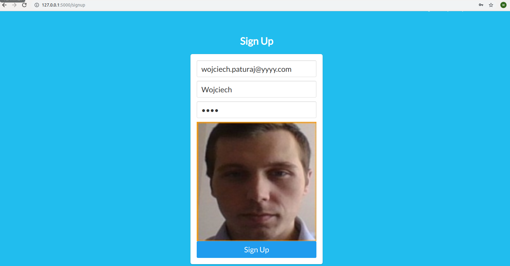
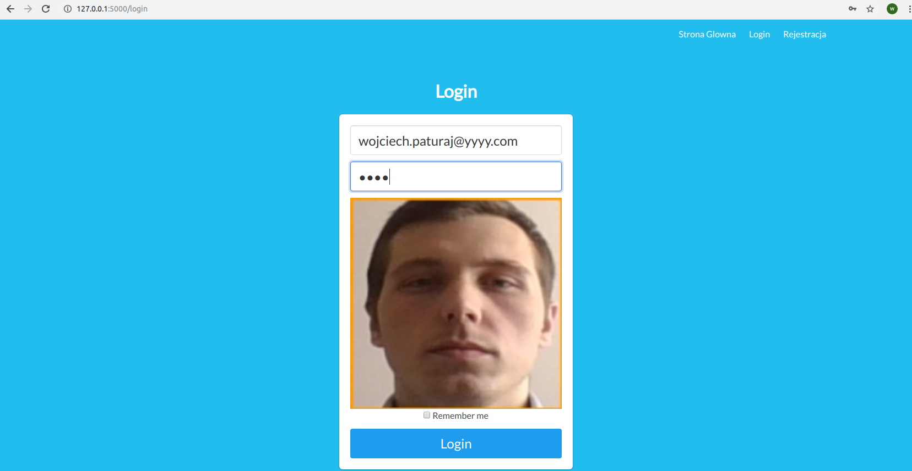
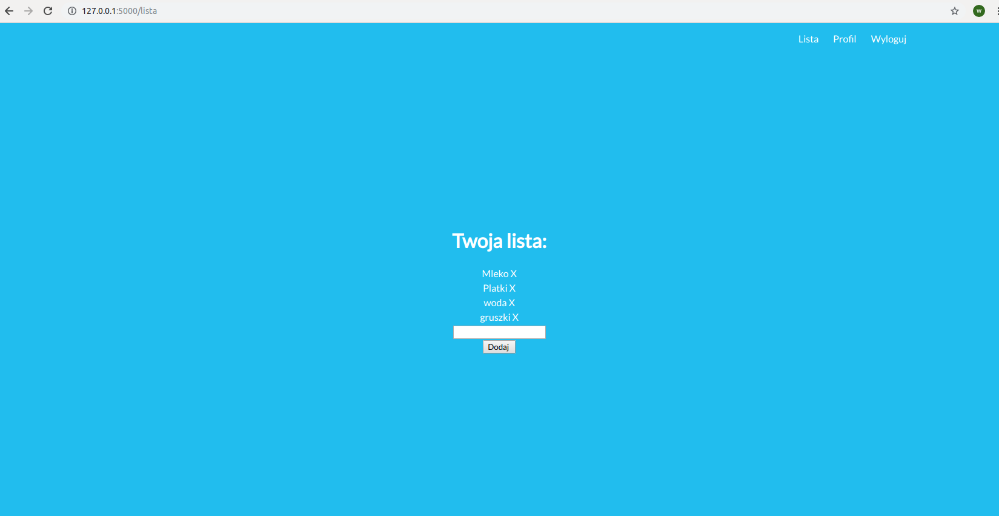
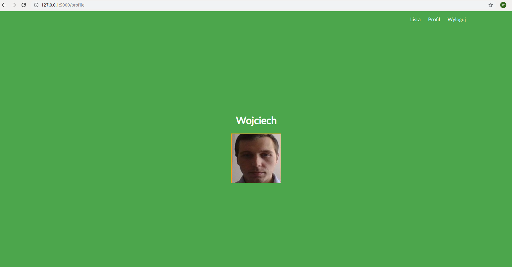

# FaceLogin
Przykład strony internetowej z wykorzystaniem AI do rozpoznawania twarzy i wyświetlania treści na stronie

Do przechowywania zgromadzonych danych wykorzystane zostały usługi na AWS takie jak:
- Amazon RDS 
- Amazon S3 Buckets

System miał na celu stworzenie serwisu do przygotowania list zakupów, gdzie logowanie
odbywa sie za pomoca zdjecia twarzy. Ze wzgledu na brak 100% skutecznosci
w działaniu modelu weryfikacji uzytkownika zdecydowano o wykorzystaniu algorytmu
jako dodatkowe zabezpieczenie do podawanego hasła. Dodatkowa funkcjonalnoscia
przygotowana w ramach serwisu jest badanie emocji uzytkownika przy okazji wyswietlenia
swojego profilu, po to aby dopasowac znajdujace sie tresci. W tym przypadku
jest to kolor wyswietlanego tła.

## Rejestracja uzytkownika

## Logowanie

## Lista zakupów

## Profil - zmiana koloru tła na podstawie zmiany emocji

## Mozliwe emocje

# Papers
F. Schroff, D. Kalenichenko, J. Philbin: FaceNet: A Unified Embedding for Face
Recognition and Clustering. Google. 2015.
